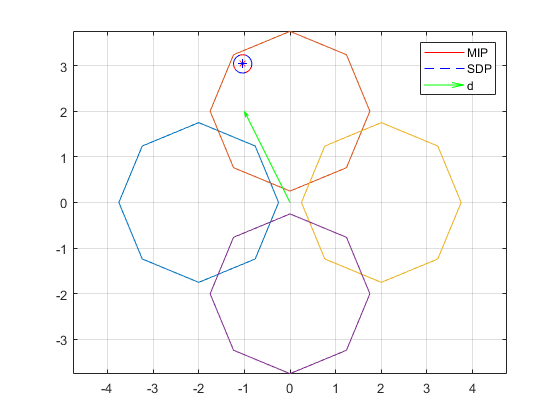
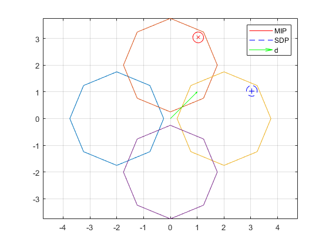

## sdp_obstacle_avoid
This project performs robot obstacle avoidance using SDP and rank minimization

## Problem statement
The obstacle avoidance constraint can be formulated as mixed-integer constraints as discussed in [1] and [2]. Suppose the collision-free workspace is decomposed into N convex polytopes excluding the obstacles. Each polytope is parameterized as $\mathcal{P}_i=\\{ x|A_ix\leq b_i \\}$. Suppose the collision body of a robot is modeled as a sphere centered at $p$ with radius $r$. The sphere being confined in the ith polytope can be written as the condition $A_ip\leq b_i-a_i r$, where $a_i(j)=|A_i(j,:)|$. The obstacle avoidance constraint is to restrict the sphere in one of the convex polytope, which can be written as

$$
\begin{aligned}
y_1 + \dots + y_N = p \\
A_i y_i \leq (b_i - \left\\|A_i\right\\| r) z_i, \quad i = 1, \dots, N \\
z_1 + \dots + z_N = 1, \quad z_i \in \\{0, 1\\}
\end{aligned}\tag{1}
$$

where $y_i=p$ if $z_i = 1$ and $y_i=0$ if $z_i=0$. 

The above obstacle avoidance constraint can also be formulated using SDP relaxation

$$
\begin{aligned}
    y_1 + \dots + y_N &= p \\
    A_i y_i &\leq (b_i - A_i r) \left(\frac{\theta_i + 1}{2}\right), \quad i = 1, \dots, N \\
    \theta_1 + \dots + \theta_N &= 2 - N, \quad \theta_i \in \\{-1, 1\\} 
\end{aligned}\tag{2}
$$

We introduce the following variable 

$$
\Theta_i = 
\begin{bmatrix}
\theta_i^2 & \theta_i \\
\theta_i & 1
\end{bmatrix}.
$$

Clearly, $\Theta_i$ is a rank 1 matrix. When $\Theta_i(1,1)=\Theta_i(2,2)=1$ and $rank(\Theta_i)=1$, we have $\theta_i=\pm 1$. Therefore, we can write (2) as linear constraints in $\Theta_i$ along with the rank constraint $rank(\Theta_i)$, which can be solved using the rank minimization discussed in [3]. 

## Implementation
This example solves the following problem.

$$
\begin{aligned}
    \text{minimize}(\\{y_i\\},\Theta) &-d*p \\
    \theta_1 + \dots + \theta_N &= 2 - N, \quad \theta_i \in \\{-1, 1\\} \\
    \forall i = 1, \dots, N:\\
    A_i y_i &\leq (b_i - A_i r) \left(\frac{\theta_i + 1}{2}\right)\\
    \Theta_i(1,1)=\Theta_i(2,2) &= 1\\
    \Theta_i &\succeq0\\
    \text{rank}(\Theta_i) &= 1
\end{aligned}\tag{3}
$$

where $p = y_1 + \dots + y_N$ and $\Theta_i = [\theta_1, \theta_2, \dots, \theta_N]$ and $d$ is a desired direction where we want the robot to be as far as possible away from the origin. This problem is convex except for the rank constraint which is non-convex. The problem is solved first without the rank constraint to get an initial solution. Then, a rank minimization algorithm from [3] is performed to iteratively move this point toward rank-1.

The solution is compared with the solution of (1) using the mixed-integer programming solver Gurobi. In this figure the two methods finds the same solution.

In this figure the solutions differ however both are optimal.

Although the SDP approach may be slower than the MIP method. It involves solving only convex problems and can be tested in the framework in [3] to tackle the obstacle avoidance constraints such as the ones in robot kinematics problems.

## References

1. Blackmore L, Ono M, Bektassov A and Williams BC "A probabilistic particle-control approximation of chanceconstrained stochastic predictive control." *IEEE Transactions on Robotics*, 26(3): 502–517, 2010.
2. Hongkai Dai, Gregory Izatt, and Russ Tedrake. "Global inverse kinematics via mixed-integer convex optimization." *The International Journal of Robotics Research*, vol. 38, no. 12-13, pp. 1420–1441, 2019.
3. Liangting Wu and Roberto Tron. "An sdp optimization formulation for the inverse kinematics problem." In *2023 62nd IEEE Conference on Decision and
Control (CDC)*, pages 4731–4738, 2023.
